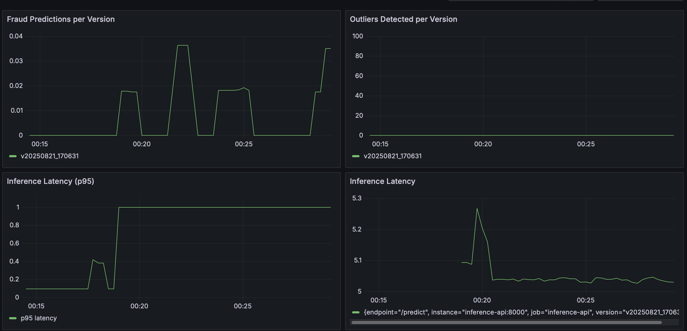
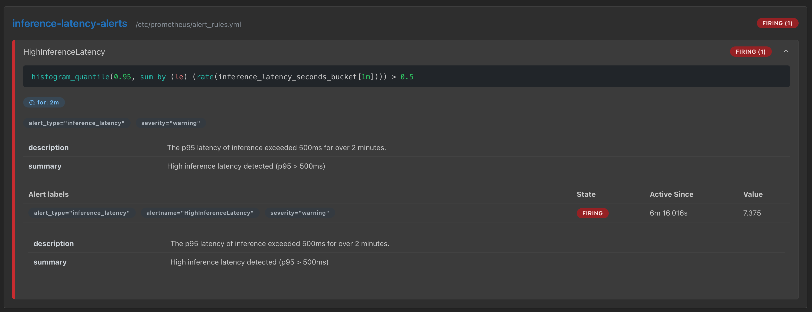
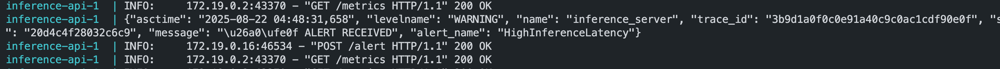

# Full MLOps Pipeline in Production 
This project demonstrates a full life cycle of a MLOps pipeline from data, preprocsessing pipeline and model development up to the deployment and monitoring of the model and the inference server using open source tools.

### Project Overview
This project implements a full MLOps system for a fraud detection task with:
- Data preprocessing & robust ML pipeline versioned by DVC, orchestrated by Airflow 3.x
- FastAPI-based inference server for online and batch predictions with 
  - Outlier detection (Isolation Forest or Z-score/IQR)
  - Input validation and schema enforcement (using Pydantic)
- Observability & monitoring: Prometheus + Grafana dashboards, alerts rules as code
- Logging and tracing for latency and pipeline analysis using OpenTelemetry + Jaeger
- Automated model rollback via MLflow model registry + Airflow DAGs +  Prometheus Alerts

### ML Pipeline
ML pipeline is tracked and reproduced by DVC and runs as an Airflow DAG for maximum flexibility. This DAG which is outlined in a DVC pipeline `dvc.yaml` has the following stages:
1. **Ingest**
   - Pulls raw dataset from remote and version it - ready to be fed into the ML development pipeline
2. **Preprocessing**
   - Trains a preprocessing pipeline (Standardization, encoding, missing value imputation, etc.)
   - Saves and versions `preprocessor.pkl` artifact for consistency at inference and training
3. **Outlier Detection**
    - Uses Isolation Forest (contamination=0.01) or Z-score/IQR to flag extreme inputs to prevent unreliable predictions at inference time
4. **Model Training**
    - Train, version model (preprocess pipeline+fraud detection model) with metadata (metrics, tags, input data)
    - Log & register model in MLflow (`mlflow.sklearn.log_model`) with signature

DVC ensures you can reproduce any experiment with the exact same dataset, pipeline and middle artifacts or configurations. It also chain the ML stages such that every stage runs only if the outputs of the previous stage has changed otherwise skipped. At every stage, latest version is pulled and after changed made by the stage, it will be pushed to remote DVC repo so it can be easily reproduced by other teammates without having to download the original data. They can start from any commit hash, pull the version from remote repo and reproduce the pipeline for that experiment. DVC keeps data and pipelines tracked and synced together without the need to keep data locally.

```sh
git checkout <commit-or-tag>  # pick the corresponding commit with the version
dvc pull  # downloads the exact deps/outs from remote
dvc repro preprocess. # returns the stage if the code has changed
```
To ingest new raw data (whether starting for the first time or want to try new raw data for new experiment), run

```sh
dvc repro ingest
``` 

### Inference Pipeline
FastAPI Microservice
   - Single inference: POST `/predict`
   - Batch inference: POST `/predict/batch`
   - Outlier detection integrated: inputs flagged before prediction
   - Input validation via `pydantic` schemas
   - Confidence threshold checks to prevent low-confidence predictions
   - Logged and traced every request life cycle


Return JSON:
```sh
././test_infer_ep.sh
---
Request #10: {"amount": 5000.0, "transaction_time": 2.0, "transaction_type": "online", "location_region": "Asia"}
{"is_fraud":1,"probability":1.0,"is_outlier":false,"anomaly_score":0.6764662176126935,"review_required":true,"version":"v20250821_170631","message":"Prediction Successful."}
---
Request #11: {"amount": 900, "transaction_time": 2.0, "transaction_type": "online", "location_region": "EU"}
{"is_fraud":0,"probability":0.36741115261724666,"is_outlier":false,"anomaly_score":0.6674423395914119,"review_required":false,"version":"v20250821_170631","message":"Prediction Successful."}
```

### Monitoring & Observability
- Each request logged (inference.log)
- Metrics exposed for Prometheus: request count, latency, outlier count, fraud count
- Prometheus Metrics
- Auto-instrument FastAPI with `prometheus-fastapi-instrumentator`
- Custom metrics via `prometheus-client`
- Grafana as Code to provision dashboards, panels from JSON/YAML files
- Prometheus alerts using alertmanager, Grafana alerts for dashboards with code

Example metrics panels:
- Model: fraud prediction rate, outlier count, accuracy, latency
- System: CPU, memory, disk usage, network

Alerts defined in YAML:
- High latency > 0.5s
- Outlier ratio > 10%

Tracing (OpenTelemetry + Jaeger)
- Automatic FastAPI instrumentation
- Manual spans for critical logic
- Trace IDs included in logs for correlation
- Visualize per-request flow & latency in Jaeger UI

### Automated Model Rollback
Trigger Criteria
- Latency spike (inference_latency_seconds > 0.5s)
- Accuracy drop (requires ground truth)
- Outlier rate surge (>10%)
- Business KPI drop

#### Rollback Flow
- Prometheus/Grafana alert fires → POST to FastAPI `/alert`
- FastAPI triggers Airflow DAG (`/api/v1/dags/model_rollback/dagRuns`)
- Airflow DAG finds last stable MLFow model
- De-promotes current model from Production → Staging
- Reloads previous model via FastAPI `/model_rollback endpoint`

#### Testing Example
`DelayedLogisticRegression` subclass simulates a slow model. Registered and versioned in MLFlow, promoted to production

- Trigger DAG `register_high_latency_model` to deploy the slow model into production.
- Run `test_infer_ep.sh` to send traffic to inference endpoint `/predict` to see inference latency increased to 5s per request: 


which triggers Prometheus alert: 

It fires to call FastAPI `/alert`


- The FastAPI alert triggers an Airflow DAG to roll the model back to the previous version in production.  
- FastAPI calls Airflow API ro run `model_rollback` DAG: `http://airflow-apiserver:8080/api/v2/dags/model_rollback/dagRuns"`. This DAG de-promotes the slow model to stage and puts back the previous model into production in MLflow. Also calls FastAPI endpoint `/rollback_model` to load the previous model.


## Running Locally
- In a terminal, run `make up` to start all services.
- Go to MinIO UI at `localhost:9001/login` with `uasername:minioadmin`, `password:minioadmin`. Create a bucket named `mlflow-artifacts` that holds artifacts of the project, DVC hashes/caches, MLFlow model versions and artifacts.
- Go to Grafana UI `localhost:3000` with `username:admin`, `password:admin`, then `dashboards` to see two dashboards:
   - ML Moniotring with panels: Fraud Predictions per Version, Outliers Detected per Version, Inference Latency (p95), Inference Latency 
   - System Moniotring with panels: CPU Usage, Memory Usage, Disk Usage (Root Partition)
- Go to Airflow UI `localhost:8080` with `username: airflow`, `password: airflow` to find the DAGs:
   - `ml_pipeline_dvc` is the ML Pipeline explained above. Trigger this DAG manually to start the pipeline. Make sure to have `--force` flag in `dvc repro ingest --force` to download ingest new data to the pipeline for the first time but remove it when pipeline finished while experimenting with this data. At every iteration, if the training stages run, the pipeline promotes the new models into production. To see the effect, manually restart the inference server: `docker compose -f ./inference/docker*.yaml restart`. Generate traffic to inference endpoint `/predict` to see online predictions.
   - Trigger `register_high_latency_model` to see push a slow version of the model into production. Restart the inference server and notice tha the response latency has increased significantly. If you let traffic in for 2 minutes, this will automatically trigger the model rollback DAG to replace the slow model with previous version. As a result, you should see an automatic drop in inference latency as traffic going through the inference endpoint.

Run `make clean` to remove all the services and images from the Dev Container.

### Possible Expansions:
1. Load Testing
   - Simulate concurrent inference requests (Locust, k6, etc.)
   - Track latency, error rate, system stress under load
2. A/B Testing
3. Drift Monitoring `monitoring/drift_job.py` : use `Evidently AI` and custom script to detecting data drift
4. Generate HTML/Markdown reports for stakeholders
5. Robustness & Production Readiness
    - Add retries and error handling in Airflow tasks and FastAPI endpoints
    - Use Kubernetes + Helm for deployment and autoscaling inference services
    - Secure APIs with OAuth2 or API keys
6. CI/CD and Testing
    - Add unit/integration tests for inference and batch scripts
    - Add GitHub Actions or Jenkins pipelines for CI/CD